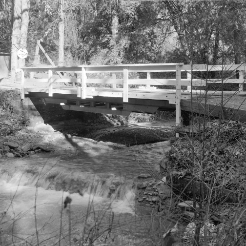

# 论文名称:Image Super-Resolution Using Very Deep Residual Channel Attention Networks

## 目录

```
1. 简介
2. 数据集和复现精度
3. 开始使用
4. 代码结构与详细说明
5. 复现模型超分效果
6. 复现模型相关信息
```

## 1. 简介

本项目复现的论文是[Yulun Zhang](http://yulunzhang.com/), [Kunpeng Li](https://kunpengli1994.github.io/), [Kai Li](http://kailigo.github.io/), [Lichen Wang](https://sites.google.com/site/lichenwang123/), [Bineng Zhong](https://scholar.google.de/citations?user=hvRBydsAAAAJ&hl=en), and [Yun Fu](http://www1.ece.neu.edu/~yunfu/), 发表在ECCV 2018上的论文。
作者提出了一个深度残差通道注意力网络（RCAN）。特别地，作者设计了一个残差中的残差（RIR）结构来构造深层网络，每个 RIR 结构由数个残差组（RG）以及长跳跃连接（LSC）组成，每个 RG 则包含一些残差块和短跳跃连接（SSC）。RIR 结构允许丰富的低频信息通过多个跳跃连接直接进行传播，使主网络专注于学习高频信息。此外，我们还提出了一种通道注意力机制（CA），通过考虑通道之间的相互依赖性来自适应地重新调整特征。


**论文:** [《Image Super-Resolution Using Very Deep Residual Channel Attention Networks》](https://arxiv.org/abs/1807.02758)

**参考repo:** [RCAN](https://github.com/yulunzhang/RCAN)

在此非常感谢`yulunzhang、MaFuyan、joaoherrera`等人贡献的[RCAN](https://github.com)，提高了本项目的复现效率。

**aistudio体验教程:** [使用PaddleGAN复现RCAN](https://aistudio.baidu.com/aistudio/projectdetail/3143865?contributionType=1&shared=1 )


## 2. 数据集和复现精度


本项目所用到的训练集以及测试集包括相应的下载地址如下:

  | Name | 数据集 | 数据描述 | 下载 |
  |---|---|---|---|
  | 2K Resolution  | [DIV2K](https://data.vision.ee.ethz.ch/cvl/DIV2K/) | proposed in [NTIRE17](https://data.vision.ee.ethz.ch/cvl/ntire17//) (800 train and 100 validation) | [official website](https://data.vision.ee.ethz.ch/cvl/DIV2K/) |
  | Classical SR Testing  | Set5 | Set5 test dataset | [Google Drive](https://drive.google.com/drive/folders/1B3DJGQKB6eNdwuQIhdskA64qUuVKLZ9u) / [Baidu Drive](https://pan.baidu.com/s/1q_1ERCMqALH0xFwjLM0pTg#list/path=%2Fsharelink2016187762-785433459861126%2Fclassical_SR_datasets&parentPath=%2Fsharelink2016187762-785433459861126) |
  | Classical SR Testing  | Set14 | Set14 test dataset | [Google Drive](https://drive.google.com/drive/folders/1B3DJGQKB6eNdwuQIhdskA64qUuVKLZ9u) / [Baidu Drive](https://pan.baidu.com/s/1q_1ERCMqALH0xFwjLM0pTg#list/path=%2Fsharelink2016187762-785433459861126%2Fclassical_SR_datasets&parentPath=%2Fsharelink2016187762-785433459861126) |


  数据集DIV2K, Set5 和 Set14 的组成形式如下:
  ```
    PaddleGAN
      ├── data
          ├── DIV2K
                ├── DIV2K_train_HR
                ├── DIV2K_train_LR_bicubic
                |    ├──X2
                |    ├──X3
                |    └──X4
                ├── DIV2K_valid_HR
                ├── DIV2K_valid_LR_bicubic
          ├── Set5
                ├── GTmod12
                ├── LRbicx2
                ├── LRbicx3
                ├── LRbicx4
                └── original
          ├── Set14
                ├── GTmod12
                ├── LRbicx2
                ├── LRbicx3
                ├── LRbicx4
                └── original
              ...
  ```
论文中模型(torch框架下训练)在Set14与Set5精度与使用paddle复现模型的精度对比：

| 框架  | Set14 |
|---|---|
| paddle  | 29.02 / 0.7910 |
| torch   | 28.98 / 0.7910 |

**Paddle模型(.pdparams)下载**

| 模型 | 数据集 | 下载地址 | 提取码 |
|---|---|---|---|
| rcan_x4  | DIV2K | [rcan_x4](https://pan.baidu.com/s/1RJ9L7Yo-G5zdWJer27biYA)| 1ry9  |


## 3. 开始使用

### 3.1 准备环境


- 硬件： Tesla V100 * 1
- 框架：
  - PaddlePaddle >= 2.1.0
  - tqdm
  - PyYAML>=5.1
  - scikit-image>=0.14.0
  - scipy>=1.1.0
  - opencv-python
  - imageio==2.9.0
  - imageio-ffmpeg
  - librosa
  - numba==0.53.1 
  - natsort
  - munch
  - easydict

将本项目git clone之后进入项目，使用`pip install -r requirements.txt`安装依赖即可。


### 3.2 快速开始

#### 第一步：克隆本项目

```bash
# clone this repo
git clone https://github.com/kongdebug/RCAN-Paddle.git
cd RCAN-Paddle
```
#### 第二步：安装依赖项
```bash
pip install -r requirements.txt
```
#### 第三步：开始训练
单卡训练：
```bash
python -u tools/main.py --config-file configs/rcan_x4_div2k.yaml
```
由于本项目没有使用多卡训练，故不提供相关代码。
如使您想使用自己的数据集以及测试集，需要在配置文件中修改数据集为您自己的数据集。

如果训练断掉，想接着训练：
```bash
python -u tools/main.py --config-file configs/rcan_x4_div2k.yaml --resume ${PATH_OF_CHECKPOINT}
```

#### 第四步：测试
- 输出预测图像
  - 可以通过第二部分拿到paddle复现的模型，放入一个文件夹中，运行如下程序，得到模型的测试结果
  - `Fig/visual`文件夹中有预测结果，可直接用于精度评价
```bash
python -u tools/main.py --config-file configs/rcan_x4_div2k.yaml --evaluate-only --load ${PATH_OF_WEIGHT}
```
- 对预测图像精度评价
  - 运行以上代码后，在``output_dir``文件夹中得到模型得预测结果,然后运行如下代码进行精度评定。**注：**--gt_dir与
output_dir两个参数得设置需要对应自己的实际路径。
```bash
python  tools/cal_psnr_ssim.py  --gt_dir data/Set14/GTmod12 --output_dir output_dir/rcan_x4_div2k*/visual_test
```
## 4. 代码结构与详细说明

### 4.1 代码结构

```
├─applications                          
├─benchmark                        
├─deploy                         
├─configs                          
├─data                        
├─output_dir                         
├─ppgan       
├─tools
├─test_tipc
├─Figs
│  README_cn.md                     
│  requirements.txt                      
│  setup.py                                         
```

### 4.2 结构说明

本项目基于PaddleGAN开发。`configs`文件夹中的`rcan_x4_div2k.yaml`是训练的配置文件，格式沿袭PaddleGAN中的SISR任务，参数设置与论文一致。`data`文件夹存放训练数据以及
测试数据。`output_dir`文件夹存放运行过程中输出的文件,一开始为空。`test_tipc`是用于导出模型预测，以及
TIPC测试的文件夹。

### 4.3 导出模型部署

- 训练结束后得到rcan_checkpoint.pdparams文件，需要进行导出inference的步骤。
    - 将rcan_checkpoint.pdparams放入`output_dir`文件夹下
    - 通过运行以下命令，在`test_tipc/output/rcan_x4`文件夹中得到
导出的.pdmodel、.pdiparams以及.pdiparams.info文件
    - [rcan_checkpoint.pdparams文件获取]( https://pan.baidu.com/s/1Yu915XVs2z56XH8VdMapyg )，提取码：yxvs
    - [导出inference的文件]( https://pan.baidu.com/s/1_dkkCyKDpzGRD7HkPIsrAQ )，提取码：o2cn
```bash
python3.7 tools/export_model.py -c configs/rcan_x4_div2k.yaml --inputs_size="-1,3,-1,-1" --load output_dir/rcan_checkpoint.pdparams --output_dir ./test_tipc/output/rcan_x4
```
- 得到以上模型文件之后，基于PaddleInference对待预测推理的测试数据进行预测。
  - 将上一步导出的inference文件(.pdmodel、.pdiparams以及.pdiparams.info
    )均放入`test_tipc/output/rcan_x4`文件夹，注：文件名称均为basesrmodel_generator
  - 运行以下命令，在`test_tipc/output/`文件夹中得到预测结果
```bash
python3.7 tools/inference.py --model_type rcan --seed 123 -c configs/rcan_x4_div2k.yaml --output_path test_tipc/output/ --device=gpu --model_path=./test_tipc/output/rcan_x4/basesrmodel_generator
```

### 4.5 TIPC测试支持

#### test_tipc文件夹下文结构
```
test_tipc/
├── configs/  # 配置文件目录
    ├── rcan    
        ├── train_infer_python.txt      # 测试Linux上python训练预测（基础训练预测）的配置文件
        ├── train_infer_python_resume.txt      # 加载模型的（基础训练预测）的配置文件
├── output/   # 预测结果
├── common_func.sh    # 基础功能程序
├── prepare.sh                        # 需要的数据和模型下载
├── test_train_inference_python.sh    # 测试python训练预测的主程序
├── readme.md                # TIPC基础链接测试需要安装的依赖说明
```

**注意：** 本项目仅提供TIPC基础测试链条中模式`lite_train_lite_infer`的代码与文档。运行之前先使用vim查看.sh文件的filemode，需要为“filemode=unix"格式。

如果没有准备训练数据，可以运行`prepare.sh`下载训练数据DIV2K，然后对其解压，调整文件组织如第二部分所示；
如果已经准备好数据，运行如下命令完成TIPC基础测试：
- 从头开始：
```bash
 bash test_tipc/test_train_inference_python.sh ./test_tipc/configs/rcan/train_infer_python.txt 'lite_train_lite_infer'
```
这里需要注意，这里测试训练时所用的配置文件为`configs`文件夹下专门为从头开始的`lite_train_lite_infer`模式设置
的`rcan_x4_div2k_tipc.yaml`文件，没有加载训练好的模型而是从头训练，所以loss会很高。运行得到的结果在`output`
文件夹中，项目中该文件夹已放入先前运行得到的日志文件。
- 加载已训练模型：
  - 将下载的rcan_checkpoint.pdparams模型文件，放入`output_dir`文件夹下，并改名为`iter_238000_checkpoint.pdparams`
  - 这里测试需要用的`configs`文件夹下的`rcan_x4_div2k.yaml`文件以及`train_infer_python_resume.txt`文件
  - 运行以下命令：
 ```bash
 bash test_tipc/test_train_inference_python.sh ./test_tipc/configs/rcan/train_infer_python_resume.txt 'lite_train_lite_infer'
``` 
按照”加载已训练模型“的命令运行之后，最后会得到inference预测的结果图以及精度评价，可以看到psnr与ssim均达标。

## 5.复现模型超分效果

| 低分辨率 | 超分重建后 | 高分辨率 |
|---|---|---|
||||
||||
||||


## 6.复现模型相关信息

相关信息:

| 信息 | 描述 |
| --- | --- |
| 作者 | 不想科研的Key.L|
| 日期 | 2021年11月 |
| 框架版本 | PaddlePaddle==2.2.0 |
| 应用场景 | 图像超分 |
| 硬件支持 | GPU、CPU |
| 在线体验 | [notebook](https://aistudio.baidu.com/aistudio/projectdetail/3143865?contributionType=1&shared=1)|


